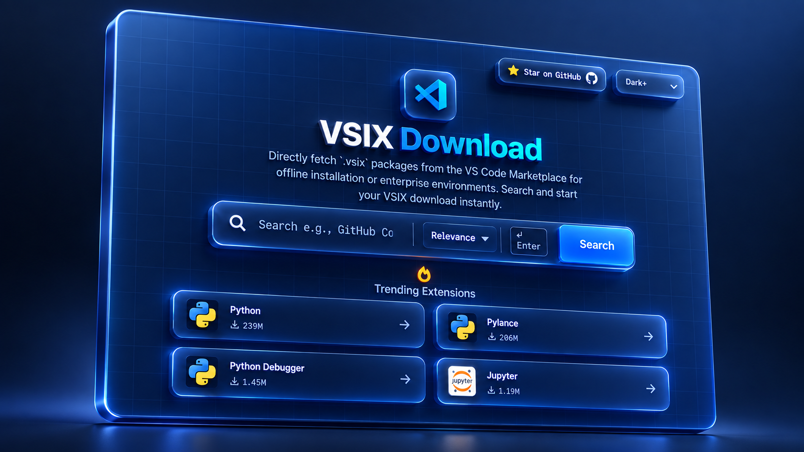

<div align="center">
  

  <h1>VSIX Downloader</h1>

  <p>
    <strong>Search, browse, and download Visual Studio Code extensions as <code>.vsix</code> files, entirely in your browser.</strong>
  </p>

  <p>
    <a href="https://zpratikpathak.github.io/vsix-downloader"></a>
    &nbsp;
    <a href="https://vsix-downloader.vercel.app/"></a>
  </p>

  <p>
    <a href="https://github.com/zpratikpathak/vsix-downloader/stargazers"></a>
    <a href="https://github.com/zpratikpathak/vsix-downloader/network/members"></a>
    <a href="https://github.com/zpratikpathak/vsix-downloader/issues"></a>
    <a href="LICENSE"></a>
    <a href="https://github.com/zpratikpathak/vsix-downloader/actions/workflows/deploy.yml"></a>
    
    
  </p>
</div>

---

<p align="center">
  
</p>

## Why this exists

The official VS Code Marketplace is great, until you need an extension on an offline machine, behind a corporate firewall, or pinned to a specific version before an update breaks your workflow.

**VSIX Downloader** talks straight to Microsoft’s Marketplace API from your browser. No accounts. No proxy. No server of ours ever touches the package.

| | |
|---|---|
| **Live (GitHub Pages)** | [zpratikpathak.github.io/vsix-downloader](https://zpratikpathak.github.io/vsix-downloader) |
| **Live (Vercel)** | [vsix-downloader.vercel.app](https://vsix-downloader.vercel.app/) |

## Features

- **Zero backend**: Static HTML/CSS/JS. Downloads come directly from `marketplace.visualstudio.com`.
- **Command-palette search**: Autocomplete suggestions, recent searches, and sort by relevance, installs, rating, or last updated.
- **Flexible queries**: Search by name, paste a Marketplace URL, or use an exact `publisher.extension` ID.
- **Full version matrix**: Browse every published version, filter stable vs pre-release, and pick the build you need.
- **Platform-aware downloads**: Detects your OS/arch and highlights the recommended build (Windows, macOS, Linux, Alpine, Web, Universal).
- **Direct `.vsix` download**: One click to fetch the package; also copy a `code --install-extension` CLI command.
- **Shareable links**: Copy a deep link to any extension for teammates.
- **Themes**: Dark+, Dracula, and Monokai (persisted in local storage).
- **Privacy-friendly**: No account required; packages never pass through a third-party download proxy.

## Use cases

- Install extensions on **air-gapped** or offline machines
- Work around **corporate firewalls** that block the Marketplace
- **Pin / back up** extension versions before risky updates
- Bundle `.vsix` files for **enterprise** or classroom fleets
- Quickly grab a package when the in-editor Marketplace is unavailable

## Quick start

### Use it online

Open the [live app](https://zpratikpathak.github.io/vsix-downloader), search for an extension, open its version list, and download the `.vsix` you need.

### Run it locally

No build step, no package manager. Just a browser:

```bash
git clone https://github.com/zpratikpathak/vsix-downloader.git
cd vsix-downloader
```

Then double-click `index.html` and open it in your favorite browser.

## Usage

1. Type an extension name (e.g. `Prettier`, `Python`), paste a Visual Studio Marketplace URL, or use a `publisher.name` ID.
2. Press **Enter** or click **Search**.
3. Open an extension to see its version history.
4. Filter by OS and release type (Stable / Pre-release) if needed.
5. **Download** the `.vsix`, or copy the CLI install command.

You can also paste a Marketplace link straight into the search box, for example:

```text
https://marketplace.visualstudio.com/items?itemName=esbenp.prettier-vscode
```

The app extracts the extension ID and jumps straight to that package.

### Install a downloaded `.vsix` in VS Code

1. Open the Extensions view (`Ctrl+Shift+X` / `Cmd+Shift+X`).
2. Open the **⋯** menu → **Install from VSIX…**
3. Select the downloaded file.

Or from a terminal:

```bash
code --install-extension path/to/extension.vsix
# or pin a Marketplace version:
code --install-extension publisher.extension@version
```

## Tech stack

| Layer | Choice |
|-------|--------|
| Markup | Semantic HTML5 |
| Styling | Tailwind CSS (CDN) + custom CSS |
| Logic | Vanilla JavaScript |
| API | [VS Code Marketplace Gallery API](https://marketplace.visualstudio.com/) |
| Hosting | GitHub Pages + Vercel |
| CI | GitHub Actions (`deploy.yml`) |

## Project structure

```text
vsix-downloader/
├── index.html              # App shell, SEO, FAQ
├── script.js               # Search, versions, platforms, downloads
├── style.css               # Themes, glass UI, animations
├── favicon.ico
├── og-image.png            # Social / Open Graph preview
├── images/                 # UI illustrations & help GIFs
├── vercel.json             # Headers & caching for Vercel
├── llms.txt                # Machine-readable project summary
├── LICENSE                 # MIT
├── SECURITY.md
├── CONTRIBUTING.md
└── .github/workflows/
    └── deploy.yml          # GitHub Pages deploy (+ optional Clarity inject)
```

## Hosting & deployment

The app is fully static and can be hosted anywhere that serves files.

- **GitHub Pages**: Push to `main`; [`.github/workflows/deploy.yml`](.github/workflows/deploy.yml) publishes automatically.
- **Vercel**: Configured via [`vercel.json`](vercel.json) (security headers + long-cache for assets).
- **Self-host**: Drop the repo onto any static host (Netlify, Cloudflare Pages, nginx, S3, etc.).

## Contributing

Contributions are welcome: bug reports, UX polish, accessibility, and docs all help.

See **[CONTRIBUTING.md](CONTRIBUTING.md)** for how to propose changes.

- [Open an issue](https://github.com/zpratikpathak/vsix-downloader/issues) for bugs or ideas
- [Open a pull request](https://github.com/zpratikpathak/vsix-downloader/pulls) when you’re ready

## Security

Downloads are fetched **directly** from Microsoft’s official Marketplace endpoints in your browser. This project does not proxy or re-host extension packages.

To report a vulnerability, please follow **[SECURITY.md](SECURITY.md)**.

## FAQ

<details>
<summary><strong>Is this official Microsoft software?</strong></summary>

No. It is an independent open-source tool that uses the public Marketplace Gallery API. Extension packages themselves are published by their authors on Microsoft’s Marketplace.
</details>

<details>
<summary><strong>Is it safe?</strong></summary>

The UI runs locally in your browser and pulls packages from `marketplace.visualstudio.com`. Treat `.vsix` files like any other software: only install extensions you trust.
</details>

<details>
<summary><strong>Why can’t I reach the Marketplace?</strong></summary>

Some school or office networks block Marketplace hosts. Try another network or a VPN, then retry the search.
</details>

<details>
<summary><strong>Does it work offline?</strong></summary>

Searching still needs network access to the Marketplace API. Once you have the `.vsix` file, you can install it offline on any machine.
</details>

## License

Released under the [MIT License](LICENSE).

Copyright © 2026 [Pratik Pathak](https://pratikpathak.com/).

---

<div align="center">
  <sub>Built with care for developers who need their tools offline.</sub>
  <br>
  <a href="https://github.com/zpratikpathak/vsix-downloader">Star the repo</a>
  ·
  <a href="https://pratikpathak.com/">pratikpathak.com</a>
</div>
